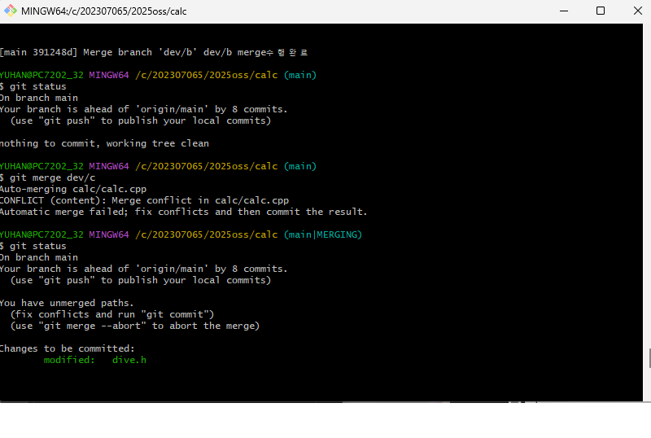
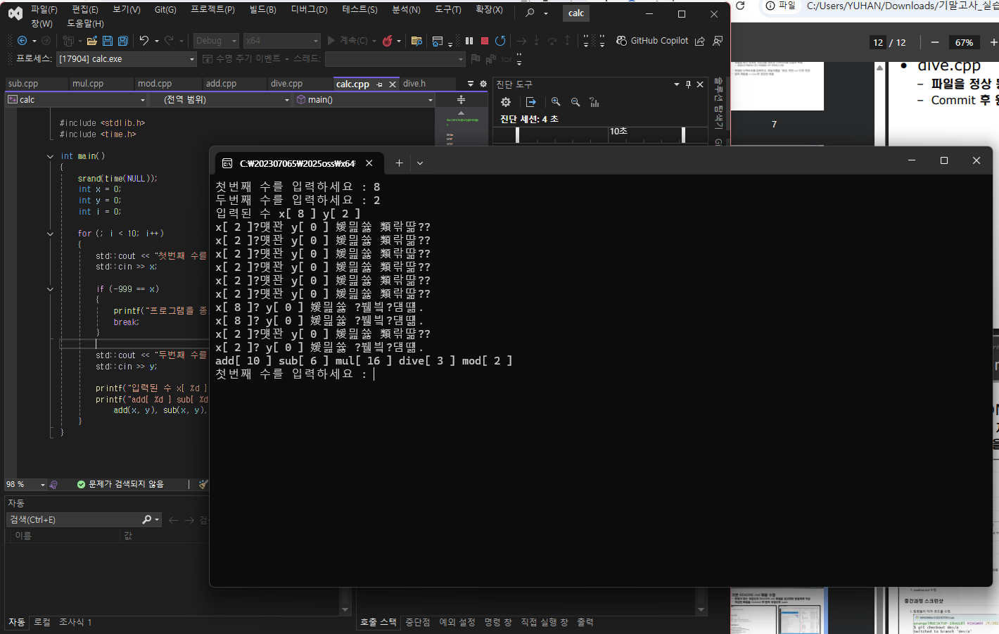
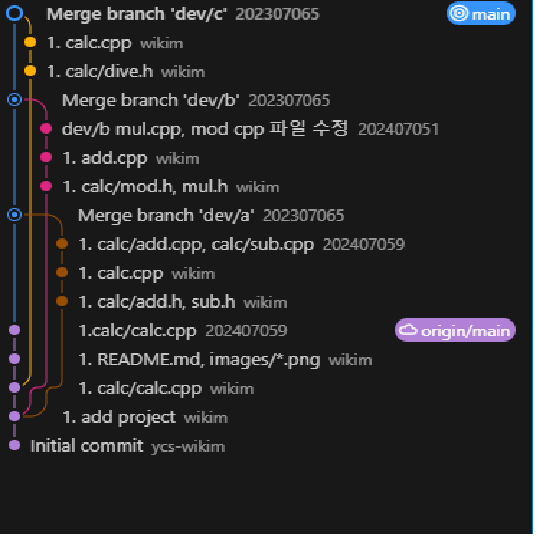

# calc
## oss 기말 프로젝트
저장소: https://github.com/TRlGGERED/2025oss

팀원(역할), 업무  
손찬혁(팀장 - 202307065) dev/c 브랜치 수정 
조용건(팀원 - 202407059) dev/a와 메인 수정 
이시영(팀원 - 202407051) dev/b 브랜치 수정

## 문제해결 방법과 순서

1. main 브랜치와 dev/a 브랜치 병합
2. main 브랜치와 dev/a 브랜치 충돌 발생
3. 충돌 발생한 dev/a의 내룔을 수정하고 병합 완료
4. main 브랜치와 dev/b 브랜치 충돌 발생
5. 충돌 발생한 dev/b의 내룔을 수정하고 병합 완료
6. main 브랜치와 dev/c 브랜치 충돌 발생
7. 충돌 발생한 dev/c의 내룔을 수정하고 병합 완료
8. 결과 화면 캡쳐와 실행 화면 캡쳐
9. readme.md 수정

## 중간과정 스크린샷

1. dev b merge 화면
 
2. 실행화면

3. git flow 화면
